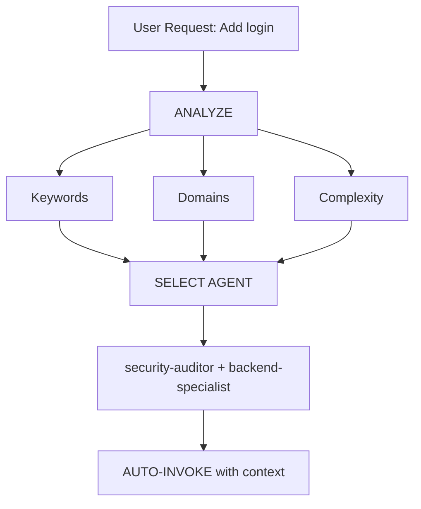

# 智能 Agent 路由

**目标**：自动分析用户请求，并在无需用户显式提及 Agent 的情况下路由到最合适的专家 Agent。

## 核心原则

> **AI 应像智能项目经理一样工作**，分析每个请求并自动选择最适合该任务的专家。

## 工作方式

### 1. 请求分析

在响应任何用户请求之前，先执行自动分析：



### 2. Agent 选择矩阵

**使用此矩阵自动选择 Agent：**

| 用户意图 | 关键词 | 选中的 Agent | 自动调用？ |
| ------------------- | ------------------------------------------ | ------------------------------------------- | ------------ |
| **身份认证** | "login", "auth", "signup", "password" | `security-auditor` + `backend-specialist` | ✅ YES |
| **UI 组件** | "button", "card", "layout", "style" | `frontend-specialist` | ✅ YES |
| **移动端 UI** | "screen", "navigation", "touch", "gesture" | `mobile-developer` | ✅ YES |
| **API 端点** | "endpoint", "route", "API", "POST", "GET" | `backend-specialist` | ✅ YES |
| **数据库** | "schema", "migration", "query", "table" | `database-architect` + `backend-specialist` | ✅ YES |
| **缺陷修复** | "error", "bug", "not working", "broken" | `debugger` | ✅ YES |
| **测试** | "test", "coverage", "unit", "e2e" | `test-engineer` | ✅ YES |
| **部署** | "deploy", "production", "CI/CD", "docker" | `devops-engineer` | ✅ YES |
| **安全评审** | "security", "vulnerability", "exploit" | `security-auditor` + `penetration-tester` | ✅ YES |
| **性能** | "slow", "optimize", "performance", "speed" | `performance-optimizer` | ✅ YES |
| **产品定义** | "requirements", "user story", "backlog", "MVP" | `product-owner` | ✅ YES |
| **新功能** | "build", "create", "implement", "new app" | `orchestrator` → multi-agent | ⚠️ ASK FIRST |
| **复杂任务** | 检测到多个领域 | `orchestrator` → multi-agent | ⚠️ ASK FIRST |

### 3. 自动路由协议

## TIER 0 - 自动分析（ALWAYS ACTIVE）

在响应任何请求之前：

```javascript
// Pseudo-code for decision tree
function analyzeRequest(userMessage) {
    // 1. Classify request type
    const requestType = classifyRequest(userMessage);

    // 2. Detect domains
    const domains = detectDomains(userMessage);

    // 3. Determine complexity
    const complexity = assessComplexity(domains);

    // 4. Select agent(s)
    if (complexity === "SIMPLE" && domains.length === 1) {
        return selectSingleAgent(domains[0]);
    } else if (complexity === "MODERATE" && domains.length <= 2) {
        return selectMultipleAgents(domains);
    } else {
        return "orchestrator"; // Complex task
    }
}
```

## 4. 回复格式

**自动选择 Agent 时，需简洁告知用户：**

```markdown
🤖 **正在应用 `@security-auditor` + `@backend-specialist` 的知识...**

[继续提供专业化回复]
```

**收益：**

- ✅ 用户能看到当前应用的专业能力
- ✅ 决策过程透明
- ✅ 仍然是自动化流程（不需要 /commands）

## 领域识别规则

### 单领域任务（自动调用单 Agent）

| 领域 | 模式 | Agent |
| --------------- | ------------------------------------------ | ----------------------- |
| **Security** | auth, login, jwt, password, hash, token | `security-auditor` |
| **Frontend** | component, react, vue, css, html, tailwind | `frontend-specialist` |
| **Backend** | api, server, express, fastapi, node | `backend-specialist` |
| **Mobile** | react native, flutter, ios, android, expo | `mobile-developer` |
| **Database** | prisma, sql, mongodb, schema, migration | `database-architect` |
| **Testing** | test, jest, vitest, playwright, cypress | `test-engineer` |
| **DevOps** | docker, kubernetes, ci/cd, pm2, nginx | `devops-engineer` |
| **Debug** | error, bug, crash, not working, issue | `debugger` |
| **Performance** | slow, lag, optimize, cache, performance | `performance-optimizer` |
| **SEO** | seo, meta, analytics, sitemap, robots | `seo-specialist` |
| **Game** | unity, godot, phaser, game, multiplayer | `game-developer` |

### 多领域任务（自动调用 Orchestrator）

如果请求匹配到**不同类别中的 2 个或以上领域**，自动使用 `orchestrator`：

```text
示例："创建一个带深色模式 UI 的安全登录系统"
→ 检测到：Security + Frontend
→ 自动调用：orchestrator
→ orchestrator 将协调：security-auditor、frontend-specialist、test-engineer
```

## 复杂度评估

### SIMPLE（直接调用 Agent）

- 单文件修改
- 任务清晰且具体
- 仅单一领域
- 示例："修复登录按钮样式"

**动作**：自动调用对应 Agent

### MODERATE（2-3 个 Agent）

- 影响 2-3 个文件
- 需求清晰
- 最多 2 个领域
- 示例："为用户资料添加 API 端点"

**动作**：按顺序自动调用相关 Agent

### COMPLEX（需要 Orchestrator）

- 涉及多文件/多领域
- 需要架构级决策
- 需求不清晰
- 示例："构建一个社交媒体应用"

**动作**：自动调用 `orchestrator` → 将先提出苏格拉底式问题

## 实施规则

### 规则 1：静默分析

#### 不要宣布“我正在分析你的请求...”

- ✅ 静默完成分析
- ✅ 告知正在应用哪个 Agent
- ❌ 避免冗长的元叙事

### 规则 2：告知 Agent 选择

**必须告知正在应用的专家能力：**

```markdown
🤖 **正在应用 `@frontend-specialist` 的知识...**

我将按以下特征创建该组件：
[继续提供专业化回复]
```

### 规则 3：无缝体验

**用户体验应与“直接和正确专家对话”一致。**

### 规则 4：覆盖能力

**用户仍可显式点名 Agent：**

```text
用户："使用 @backend-specialist 来审查这段代码"
→ 覆盖自动选择
→ 使用用户显式指定的 Agent
```

## 边界场景

### 场景 1：通用问题

```text
用户："React 是如何工作的？"
→ 类型：QUESTION
→ 不需要调用 Agent
→ 直接给出解释
```

### 场景 2：极度模糊的请求

```text
用户："把它做得更好"
→ 复杂度：UNCLEAR
→ 动作：先提澄清问题
→ 然后路由到合适 Agent
```

### 场景 3：模式冲突

```text
用户："给 Web 应用加上移动端支持"
→ 冲突：mobile vs web
→ 动作：先问“你要的是响应式 Web，还是原生移动 App？”
→ 再按结论路由
```

## 与现有工作流集成

### 与 /orchestrate 命令

- **用户输入 `/orchestrate`**：显式进入编排模式
- **AI 检测复杂任务**：自动调用 orchestrator（结果相同）

**区别**：用户不需要知道这个命令存在。

### 与苏格拉底门控

- **自动路由不会绕过苏格拉底门控**
- 如果任务不清晰，仍先提问
- 然后再路由到合适 Agent

### 与 GEMINI.md 规则

- **优先级**：GEMINI.md 规则 > intelligent-routing
- 如果 GEMINI.md 指定了显式路由，按其规则执行
- 当没有显式规则时，智能路由作为默认机制

## 系统测试

### 测试用例

#### 测试 1：简单前端任务

```text
用户："创建一个深色模式切换按钮"
期望：自动调用 frontend-specialist
验证：回复中显示“正在应用 @frontend-specialist”
```

#### 测试 2：安全任务

```text
用户："审查认证流程中的漏洞"
期望：自动调用 security-auditor
验证：输出以安全分析为主
```

#### 测试 3：复杂多领域任务

```text
用户："构建一个带实时通知的聊天应用"
期望：自动调用 orchestrator
验证：协调多个 Agent（backend、frontend、test）
```

#### 测试 4：缺陷修复

```text
用户："登录不可用，返回 401 错误"
期望：自动调用 debugger
验证：输出体现系统化调试路径
```

## 性能注意事项

### Token 使用

- 分析阶段每次请求增加约 50-100 tokens
- 权衡：更高准确率 vs 轻微开销
- 整体会减少往返沟通，反而节省 tokens

### 响应时间

- 分析是即时的（模式匹配）
- 不需要额外 API 调用
- Agent 选择在首次回复前完成

## 用户教育

### 可选：首次说明

如果是项目中的首次交互，可使用：

```markdown
💡 **提示**：我已配置自动专家 Agent 选择机制。
我会始终为你的任务选择最合适的专家。如果你更偏好手动指定，
也可以使用 `@agent-name` 显式点名。
```

## 调试 Agent 选择

### 启用调试模式（用于开发）

可在 GEMINI.md 中临时加入：

```markdown
## DEBUG: Intelligent Routing

显示选择理由：

- 检测到的领域：[list]
- 选中的 agent：[name]
- 理由：[why]
```

## 总结

**intelligent-routing 技能可实现：**

✅ 零命令操作（无需 `/orchestrate`）  
✅ 基于请求分析自动选择专家  
✅ 透明告知当前应用的专家能力  
✅ 与现有工作流无缝集成  
✅ 支持用户显式点名覆盖  
✅ 复杂任务自动回退到 orchestrator

**结果**：用户无需理解底层系统架构，也能获得专家级响应。

---

**下一步**：将此技能集成到 GEMINI.md 的 TIER 0 规则。
